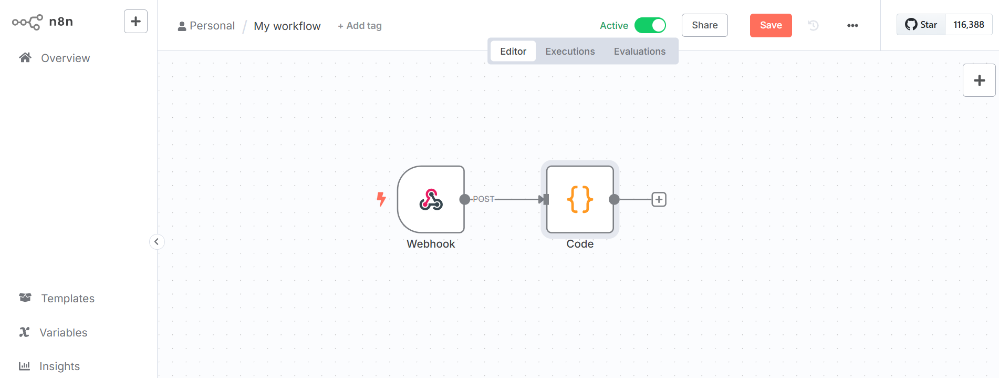

# Day 8 – Intro to n8n & Webhooks

## What I Did

1. Installed n8n locally and ran it using `n8n` on port 5678.
2. Created a workflow named **"Day 8 – Webhook Logger"**.
3. Added a **Webhook node** with:
   - Method: `POST`
   - Path: `/log-payload`
4. Connected it to a **Code node** (similar to Function node) to log incoming JSON.
5. Sent a `curl` POST request with JSON payload to test it.
6. Viewed the result in the workflow output pane.
7. Downloaded the workflow as JSON and added it to my documentation folder.

## How the Workflow Works

- The Webhook listens for POST requests at:
http://localhost:5678/webhook-test/log-payload

- When a request is received, it sends the data to the Code node.
- The Code node logs the data and passes it forward.

## Screenshot

## Workflow Export

Download the exported JSON here:  
[day8-webhook-logger.json](./day8-webhook-logger.json)